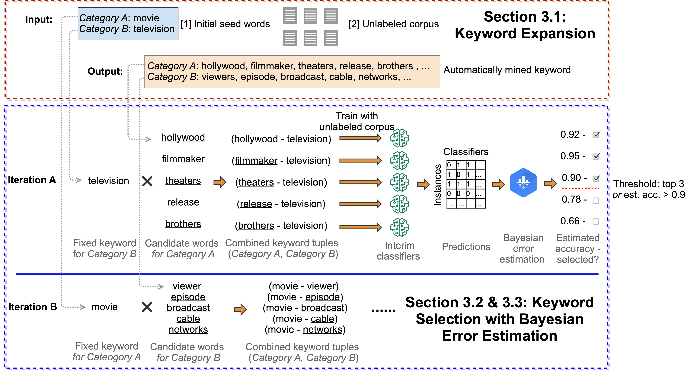

# OptimSeed

The source code and seed word sets used for [Seed Word Selection for Weakly-Supervised Text Classification with Unsupervised Error Estimation](paper/paper.pdf), to appear in NAACL-HLT SRW 2021.

<p align="center"></p>

## Step I: Keyword Expansion
TODO

## Step II: Train Weakly-Supervised Classifiers with Candidate Seed Words

We use the Generalized Expectation (GE) Java implementation provided in the [MALLET library](http://mallet.cs.umass.edu/ge-classification.php). The code is relatively straight-forward to set up and run. We do not provide the Java code to train interim classifiers. You can either follow the instructions in the MALLET library to use GE or replace it with another weakly-supervised text classification model.

## Step III: Unsupervised Error Estimation
TODO

## Seed Words in the Paper

We provide the full list of seed words for all datasets under the [seedwords](seedwords) folder. The seed word files are named according to the following convention: 

```
[dataset name]-[category A]-[category B]-[seed word set]
```

An example `AGNews-business-sports-all` means it's from AGNews dataset the Business-Sports classification task and using all keywords after keyword expansion. Note that the naming of the seed word sets are slightly different. Please refer to the mapping below:

| Seed word set in this repo | Seed word set in the paper (Table 3 & 4) |
|----------------------------|------------------------------------------|
| seed                       | cate                                     |
| all                        | -                                        |
| ours                       | ours                                     |
| manual                     | seed                                     |

## Citations

Please cite the following paper if you find the code helpful for your research.
```
@inproceedings{jin2021seed,
  title={Seed Word Selection for Weakly-Supervised Text Classification with Unsupervised Error Estimation},
  author={Jin, Yiping and Bhatia, Akshay and Wanvarie, Dittaya},
  booktitle={Proceedings of the 2021 Conference of the North American Chapter of the Association for Computational Linguistics: Student Research Workshop},
  year={2021}
}
```
